#### Author: AMD

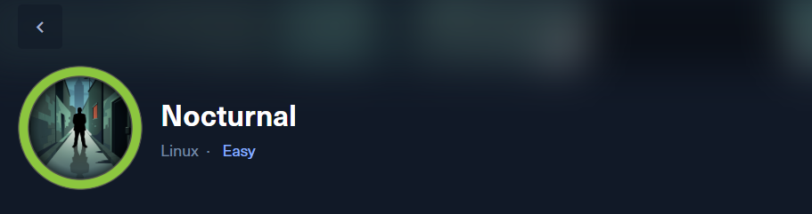

This is a writeup for <b>Nocturnal</b> machine.

My target IP: 10.10.11.64

-----------------------------------------------------------------------------------
<b>NMAP</b>

Lets scan out target.

-----------------------------------------------------------------------------------
<b>CURL</b>

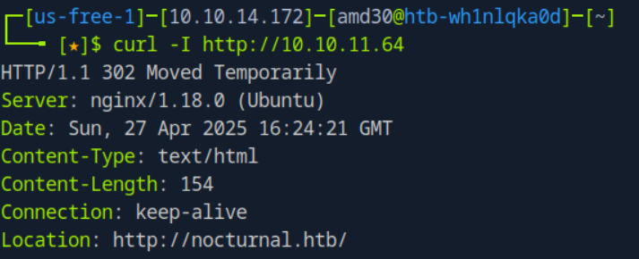

Add "10.10.11.64   nocturnal.htb" to /etc/hosts

-----------------------------------------------------------------------------------
<b>GOBUSTER</b>

we can not access these urls

-----------------------------------------------------------------------------------
<b>WEBSITE INSPECTION</b>

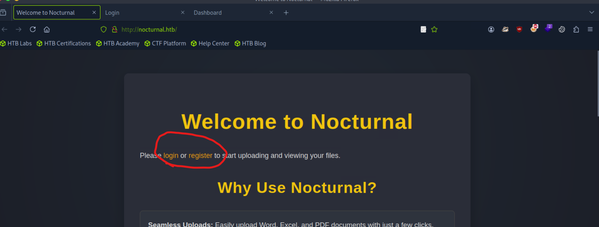

First register then login

-----------------------------------------------------------------------------------
<b>TEST FILE UPLOAD</b>

Test file upload with .php file

See the valid file types

Upload valid file and see the link

-----------------------------------------------------------------------------------
<b>FIND OTHER USERS</b>

Lets try to find the other users and use the file link to access other users files.

use https://github.com/C0euss/Nocturnal-Username-Enumeration/tree/main to find other usernames

-----------------------------------------------------------------------------------
<b>GUESS FILE NAMES</b>

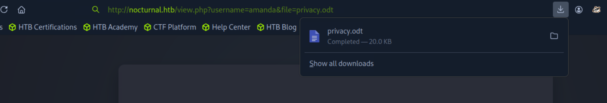

http://nocturnal.htb/view.php?username=amanda&file=privacy.odt

-----------------------------------------------------------------------------------
<b>VIEW FILE</b>

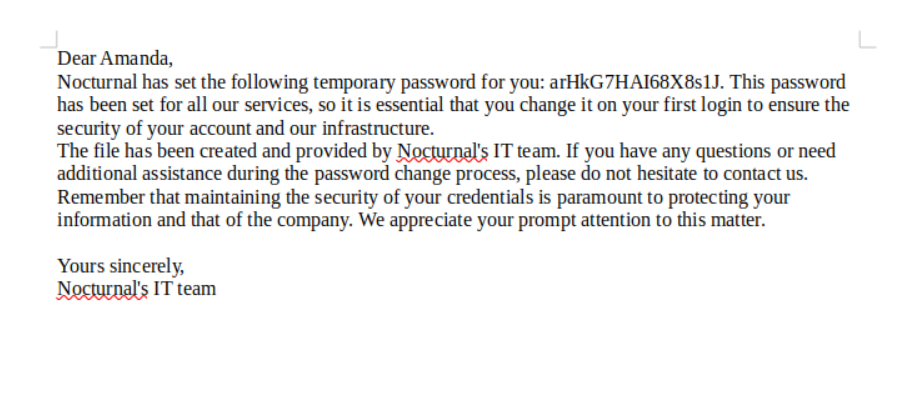

login with amanda and password

-----------------------------------------------------------------------------------
<b>VIEW PAGES</b>

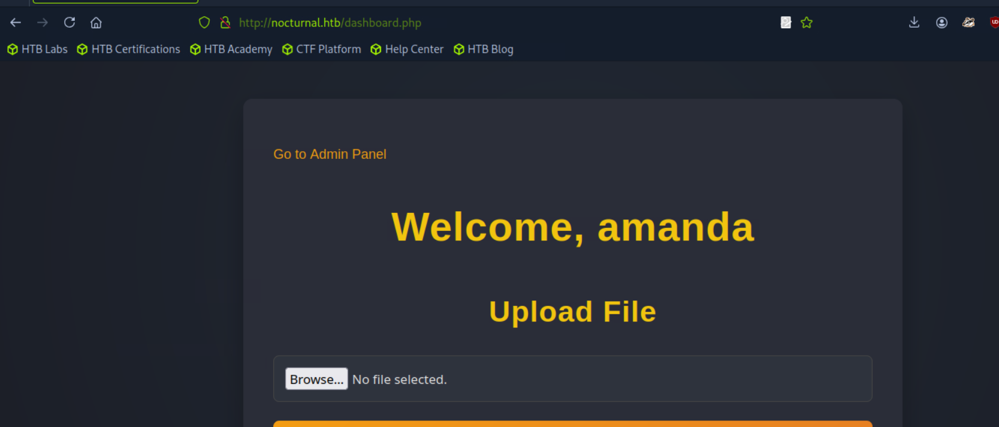

go to admin panel

-----------------------------------------------------------------------------------
<b>VIEW LOGIN.PHP</b>

Get db information

-----------------------------------------------------------------------------------
<b>RCE</b>

Enter "dummy" to create backup password field, catch the request with burpsuite and send it to repeater.

url CyberChef to url encode

send with repeater

-----------------------------------------------------------------------------------
<b>SSH</b>

Crack tobias's password using https://crackstation.net/

connect with ssh

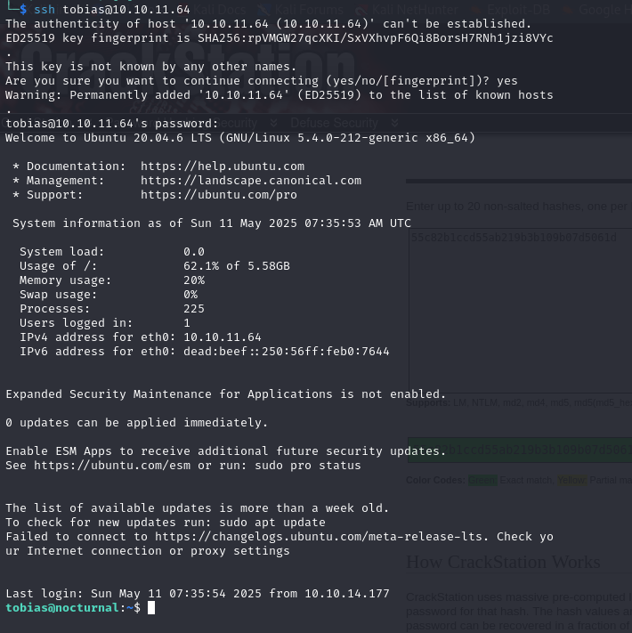

-----------------------------------------------------------------------------------
<b>GET USER FLAG</b>

-----------------------------------------------------------------------------------
<b>NETSTAT</b>

Use netstat to use what is working on the machine

-----------------------------------------------------------------------------------
<b>PF</b>

We cannot visit http://127.0.0.1:8080 so lets try port forwarding

Lets visit http://127.0.0.1:8080

-----------------------------------------------------------------------------------
<b>LOGIN</b>

Lets try to login with tobias's credentials --> doesnt work

Lets try other usernames we found (amanda, admin)  --> admin works

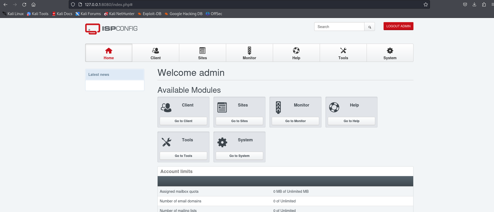

-----------------------------------------------------------------------------------
<b>EXEMINE SITE</b>

Lets find vulnerability for this version ISPConfig 

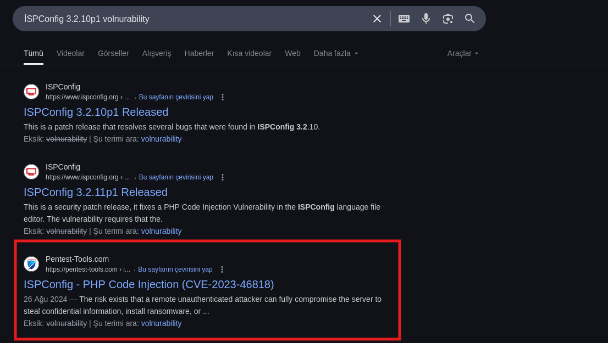

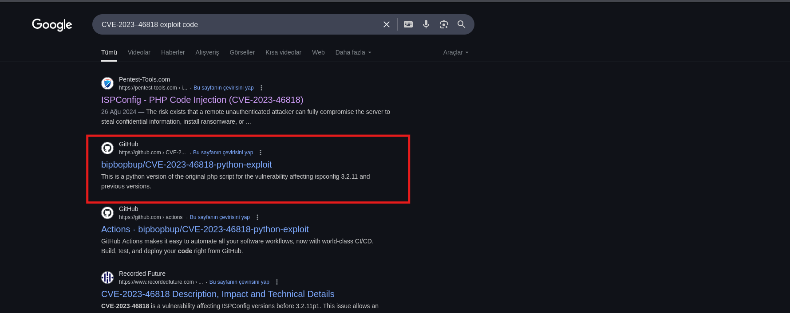

-----------------------------------------------------------------------------------
<b>EXPLOIT VULNURABILITY</b>

run "nano CVE-2023-46818.py"  --> paste the code  --> save and exit

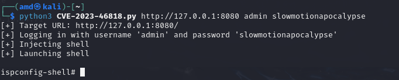

-----------------------------------------------------------------------------------
<b>GET ROOT FLAG</b>

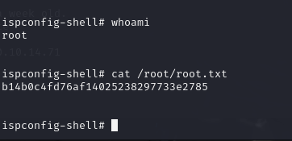
