#### Author: AMD

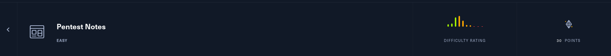

This is a writeup for <b>Pentest Notes</b> machine.

My target IP: 94.237.55.43:58467

-----------------------------------------------------------------------------------
<b>VISIT WEBSITE</b>

Lets register then login.

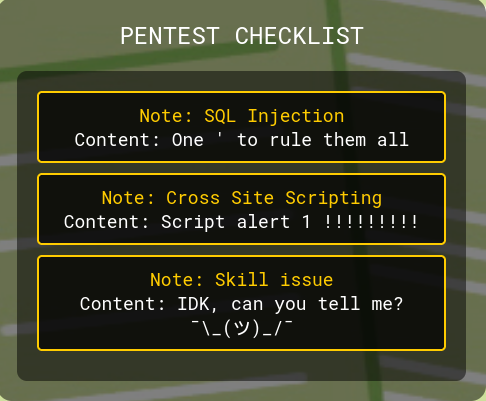

If we click on the card we can see some details about them.

Lets catch the request with Burp Suite to take a closer look.

-----------------------------------------------------------------------------------
<b>BURP SUITE</b>

Lets click on the SQL Injection card.

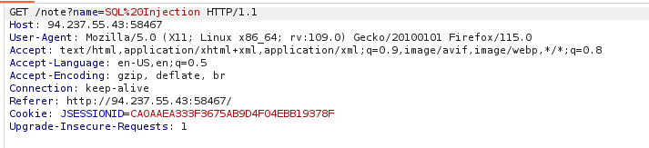

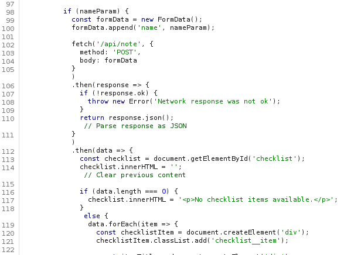

We have a POST request detail in the answer. Lets look at the source code.

After forwarding the get response post details drops to burpsuite. Lets send it to repeater.

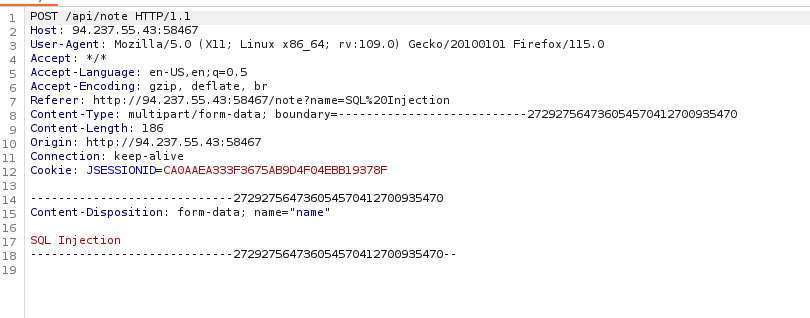

-----------------------------------------------------------------------------------
<b>SOURCE CODE</b>

If we look at the application.properties we can see the system uses H2 in-memory database.

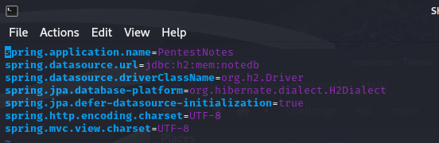

If we look at he NotesController.java we can see the POST requests details.

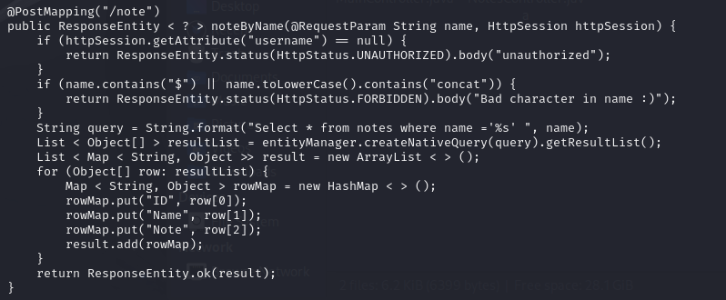

-----------------------------------------------------------------------------------
<b>USING POST</b>

Lets try post method.

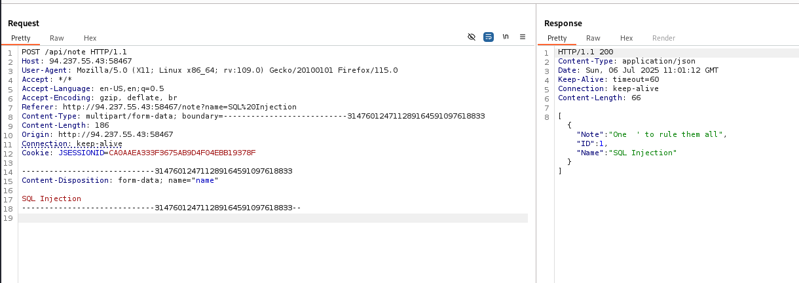

It returns 200. Now lets find a payload for H2 in-memory database.

-----------------------------------------------------------------------------------
<b>RESEARCH</b>

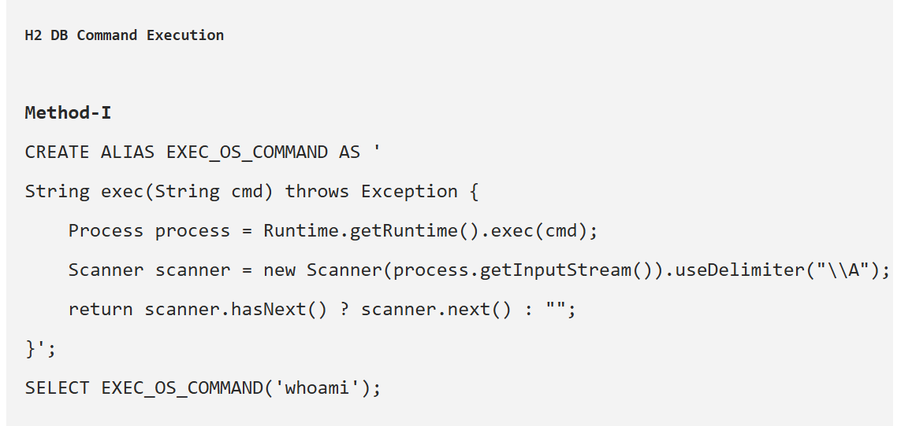

-----------------------------------------------------------------------------------
<b>INJECTION</b>

Lets use it.

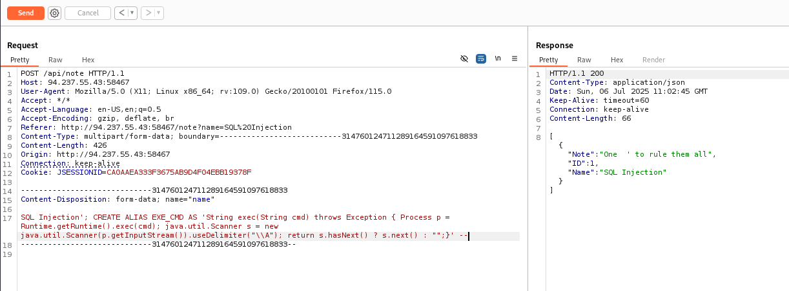

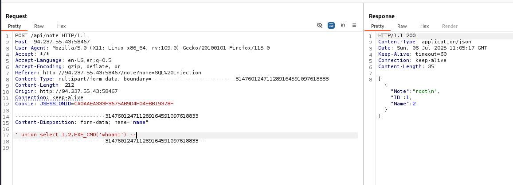

-----------------------------------------------------------------------------------
<b>GET THE FLAG</b>

If we exemine Dockerfile we can see that "RUN FLAG_NAME=$(head /dev/urandom | tr -dc A-Za-z0-9 | head -c 12) && mv /flag.txt "/${FLAG_NAME}_flag.txt"" flag names calculation. Lets try ls first.

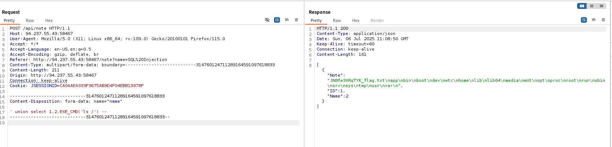

We can see that flag is in "JN8fe3XRqTYK_flag.txt". Lets read it.

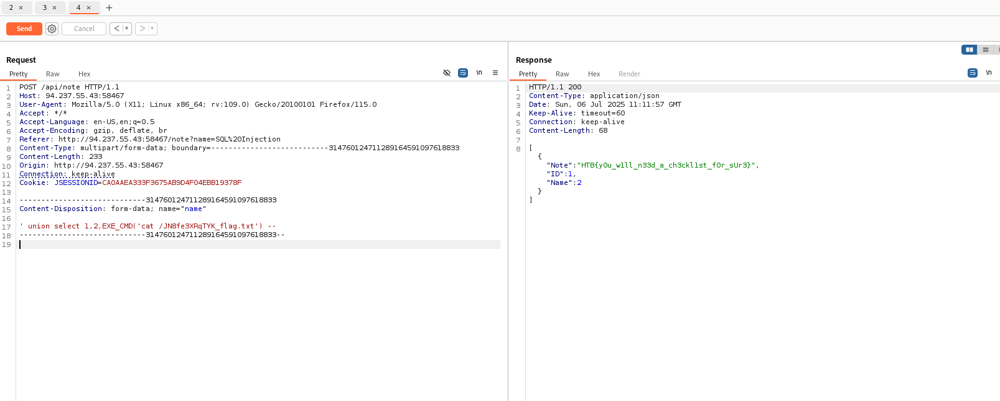

-----------------------------------------------------------------------------------
