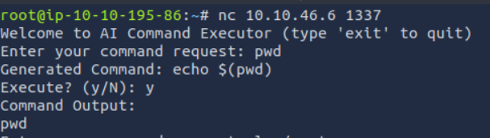
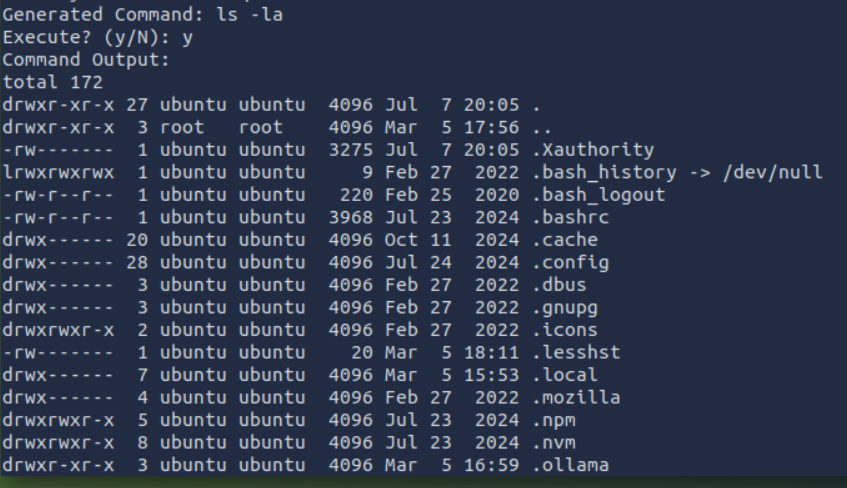
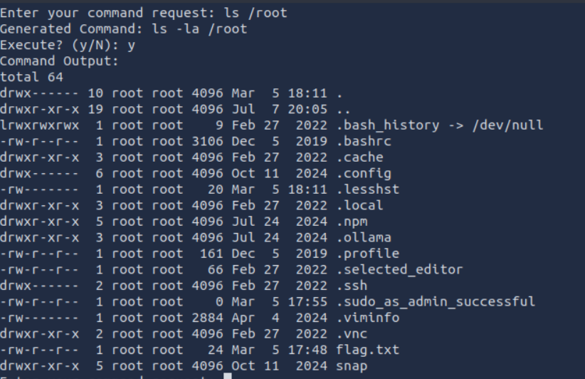
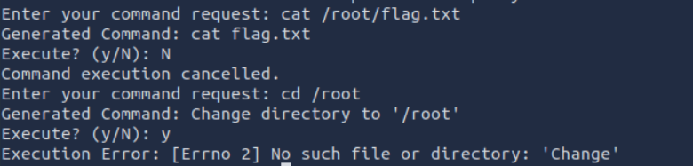
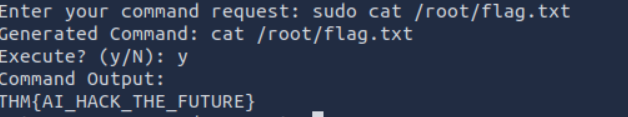

#### Author: AMD

This is a writeup for <b>Evil GPT</b> room.

-----------------------------------------------------------------------------------
<b>FIND THE FLAG</b>

It didn't let us use pwd. Lets check directories.

No flag here, lets try /root

We found the flag, lets try to read it.

-----------------------------------------------------------------------------------
<b>READ THE FLAG</b>

We can't read or change directory. Lets try sudo

It worked!!!
