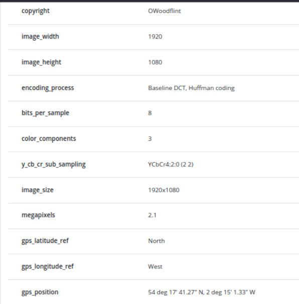
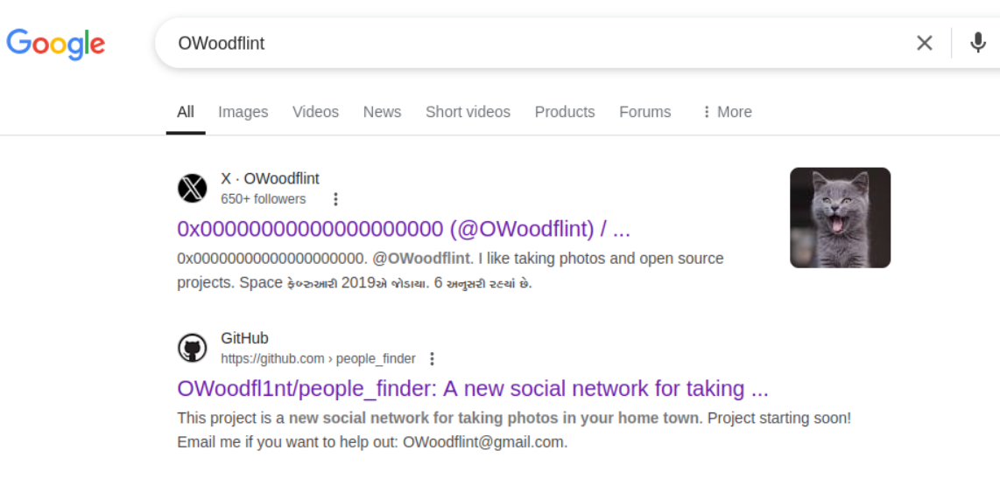
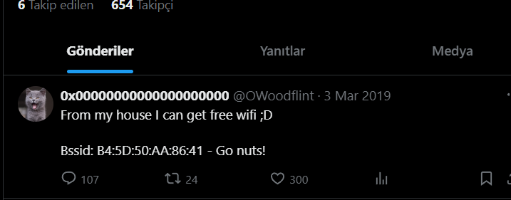
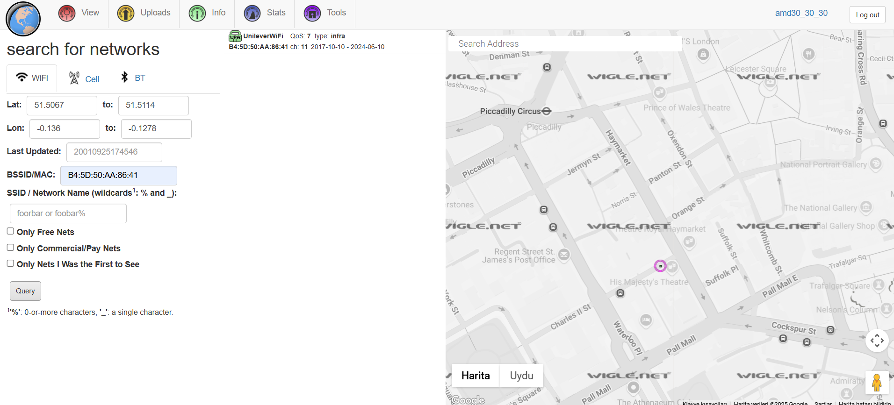
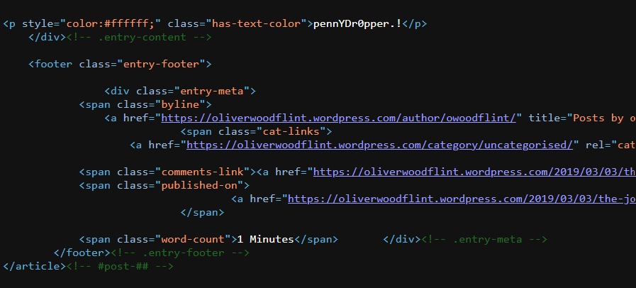

#### Author: AMD

This is a writeup for <b>OhSINT</b> room.

-----------------------------------------------------------------------------------
<b>VIEW METADATA</b>

View the data using an extractor of your choice. I used https://www.metadata2go.com/ 

We can see the gps coordinates and the owner(OWoodflint) from here.

-----------------------------------------------------------------------------------
<b>SEARCH THE OWNER</b>

The avatar is a cat

-----------------------------------------------------------------------------------
<b>GO THROUH X ACCOUNT</b>

-----------------------------------------------------------------------------------
<b>FIND LOCATION</b>

Find the location and SSID by using the bssid from the post with https://wigle.net/

-----------------------------------------------------------------------------------
<b>GO THROUGH HIS GITHUB</b>

Found the personal email.

Found the website.

-----------------------------------------------------------------------------------
<b>GO THROUGH HIS WEBSITE</b>

Can the holiday location be New York?

-----------------------------------------------------------------------------------
<b>VIEW THE PAGE SOURCE</b>

Lets try to find the password in the page source.

Can this be the password?

-----------------------------------------------------------------------------------
<b>OHSHINT, THE ROOM IS COMPLETED</b>

